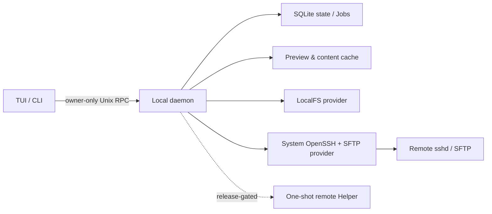

# AMSFTP

AMSFTP 是一个面向 macOS 和 Linux 终端用户的 Vim-first 双栏文件工作台。任一栏都可以指向本地目录或 `~/.ssh/config` 中的远端主机；浏览、预览、编辑、搜索和传输统一通过本地 daemon 协调，认证与主机策略继续由系统 OpenSSH 负责。

> [!WARNING]
> `v0.1.18` 是当前公开预览版本线。macOS 产物未经签名或公证，它不是公开的 AMSFTP 1.0；标准 Level 0 SFTP 路径可用，production Helper 和 Level 2 跨主机直传仍为 **CLOSED**。

## 主要能力

- Vim-first 双栏 TUI，本地和远端位置可以自由组合。
- 选中文件或目录后，底部动作栏按对象类型、焦点和有效 keymap 就地提示可用快捷键，并持续标识当前 AMSFTP 版本。
- 复用系统 OpenSSH 的密钥、Agent、Kerberos/GSSAPI、ProxyJump 和 ProxyCommand 配置。
- 复制、移动、重命名和删除统一生成持久 Job；退出 TUI 不会隐式取消后台任务。
- 未限速的标准 SFTP 下载使用有界 1 MiB / 32 请求读取窗口，减少高延迟链路在每个 256 KiB durable 块之间的空等。
- Jobs 使用四秒滚动平均展示传输速度；选中 relay Job 时可查看 read、write、sync、stat 和 checkpoint 的累计阶段耗时。
- 目标端先写 Job 专属临时文件，验证并提交后才暴露最终文件；跨端点移动在目标确认完成前不删除来源。
- 有界目录浏览、预览、搜索、缓存和传输调度，避免把完整大目录、整棵树或完整大文件载入内存。
- 文本/图片预览、远端文件本地编辑、默认应用打开、内容缓存和并发修改检查。
- `doctor`、结构化日志和显式同意的本地支持包，用于无破坏诊断。

当前能力和限制的精确状态见[功能矩阵](docs/product/feature-matrix.md)与[项目状态](docs/development/status.md)。

## 系统要求

- macOS 15+，或 Ubuntu 22.04/24.04；其他 Linux 目前按 best-effort 处理。
- 系统 `/usr/bin/ssh`，远端提供 SFTP subsystem。
- 使用源码开发时需要 Go 1.26.5；兼容门禁另使用 Go 1.25.12。
- 远端主机应先在 `~/.ssh/config` 中配置为普通 alias，例如 `work`。

AMSFTP 不接管密码、私钥、Agent 内容或 Kerberos 票据，也不会为了加速传输自动开启 Agent forwarding、凭据委托或远端常驻服务。

## 安装与升级

公开预览发布页：[`v0.1.18`](https://github.com/TyrantLucifer/awesome-sftp-cli/releases/tag/v0.1.18)。历史 owner-only 内部预览仍可通过 Git 历史与旧 tag 追溯。

严格 `X.Y.Z` 的公开预览发布后，可直接使用下面任一渠道。安装脚本默认安装到 `$HOME/.local`，会校验归档 SHA-256、原子替换 binary、保存上一版为 `amsftp.previous`，并重新生成 man page 与 shell completion：

```sh
curl --proto '=https' --tlsv1.2 -fsSL \
  https://github.com/TyrantLucifer/awesome-sftp-cli/releases/latest/download/install.sh | sh
```

安装器在替换任何现有文件前预检 binary、配置、状态和缓存路径的 owner/mode/ACL/no-symlink 链。若默认 HOME 布局不可信，它会自动复用管理员已预置且通过校验的 `/var/lib/amsftp-users/<uid>`；若该根尚不存在，安装保持零目标变更并输出一次性初始化命令。受管根会持久记录布局，后续启动和升级不需要手工设置 XDG 变量；也可用 `--root /absolute/path` 显式选择已预置的可信根。再次运行同一命令即可升级。也可以使用 Homebrew：

```sh
brew install TyrantLucifer/tap/amsftp
brew upgrade TyrantLucifer/tap/amsftp
```

安装完成后，macOS 与 Linux 上的 Homebrew/独立安装都可以统一执行：

```sh
amsftp upgrade
```

该命令先检查渠道和目标版本；只有确有新版本时才通过 owner-only RPC 请求升级停机。Human 模式会在检查更新、检查/停止 daemon、渠道升级、重启和验证开始前持续输出阶段进度，耗时的下载与安装阶段也会明确提示可能需要几分钟；JSON 模式仍只输出一个稳定结果对象。Homebrew 安装委托给 `brew upgrade`，独立安装校验发布的 `install.sh` checksum 后复用安装器。升级命令会在整个停机、替换、重启和验证期间持有 owner-private 升级门控；其他正在运行的 TUI 会等待门控释放后连接新 daemon，而不会在 Homebrew 下载期间用旧 binary 抢先恢复旧 daemon，同时第二个升级命令会以 conflict 退出。升级前 daemon 若在运行，升级后才会恢复；若有正在执行的 Job，命令以 conflict 退出，不会静默中断任务。升级已经替换 binary、但最终验证失败时，错误会区分新 binary 或重启 daemon 的版本检查，并给出 `amsftp --version`、daemon status 和 doctor 等下一步。上面的 `curl` 与 `brew upgrade` 仍可用于恢复或手工维护。

历史 owner-only 内部版本不属于这个公开渠道，仍按下面的手工步骤安装：

1. 选择与本机 OS/架构匹配的归档并同时取得 `checksums.txt`。
2. 使用 `sha256sum -c checksums.txt`（macOS 可使用 `shasum -a 256`）核对下载内容。
3. 解压后将 `amsftp` 放入所有者控制的 `PATH` 目录。
4. 可选安装归档中的 man page 与 shell completion。
5. 运行：

   ```sh
   amsftp --version
   amsftp config validate
   amsftp doctor --format json
   ```

macOS 归档尚未签名或公证。命令行安装可避免 Finder 下载路径带来的额外交互，但不等于 Apple 签名或公证；不要对无法独立确认来源和 checksum 的下载内容关闭系统安全策略。完整安装、升级和卸载边界见[安装说明](docs/release/INSTALL.md)、[升级与回滚](docs/release/UPGRADE.md)和[卸载说明](docs/release/UNINSTALL.md)。

## 首次连接

先让系统 OpenSSH 完成主机密钥和认证交互：

```sshconfig
Host work
    HostName dev.example.com
    User alice
    IdentityFile ~/.ssh/id_ed25519
```

```sh
/usr/bin/ssh work
amsftp daemon start --format json
amsftp doctor --endpoint work --format json
amsftp /absolute/local/path work:/absolute/remote/path
```

位置语法：

- 本地：绝对路径，例如 `/Users/alice/Downloads`。
- 远端：`<SSH alias>:<absolute path>`，例如 `work:/srv/project`。
- 已保存工作区：`amsftp --workspace <name>`。
- 不传位置时进入交互选择流程。

复杂 SSH 配置仍由 `/usr/bin/ssh` 解释。若 alias 使用 Kerberos，请先通过系统工具确认票据有效；AMSFTP 不会把票据或认证答案写入配置、数据库、Job 或日志。

## 默认操作

| 按键 | 作用 |
| --- | --- |
| `h` / `j` / `k` / `l` 或 `←` / `↓` / `↑` / `→` | 返回上级、下移、上移、进入目录 |
| `Tab` | 切换活动栏 |
| `c` | 从 `local` 与 OpenSSH Host 列表中模糊筛选并切换活动栏 Endpoint |
| `Space`、`v`、`V` | 离散或连续选择 |
| `y` | 复制文件引用 |
| `d` | 剪切文件引用，不立即删除 |
| `p` | 在另一栏规划并提交粘贴 Job |
| `D` | 进入独立确认的删除流程 |
| `K` / `J` / `L` | 打开 Preview / Jobs / Log 抽屉 |
| `e` / `o` | 使用终端编辑器编辑 / 使用默认应用打开 |
| `/` / `f` / `g/` | 当前目录模糊跳转 / 文件名搜索 / 内容搜索 |
| `!` / `gs` | 一次性命令 / 交互 shell |
| `q` | 退出当前 TUI；不隐式取消后台 Job |

可用 `amsftp config print-effective-keymap` 查看实际键位。完整说明见[键位参考](docs/user/keymap.md)。
主界面底部动作栏会优先显示当前选中对象可执行的操作：普通文件包含编辑、外部打开、预览、复制、移动、删除和重命名，目录只显示适用操作，Visual 模式收敛为批量操作；自定义键位会同步反映在提示中。动作栏右侧固定显示当前构建版本。

## 安全传输与 Job

`y`/`d` 只修改剪贴板引用，`p` 才创建传输意图。覆盖、不可逆删除、跨端点移动和直传选择必须显示计划并单独确认。

```sh
amsftp job list --format json
amsftp job events job_aaaaaaaaaaaaaaaaaaaaaaaaaa --after 0 --limit 50 --format json
amsftp job pause job_aaaaaaaaaaaaaaaaaaaaaaaaaa
amsftp job resume job_aaaaaaaaaaaaaaaaaaaaaaaaaa
amsftp job cancel job_aaaaaaaaaaaaaaaaaaaaaaaaaa \
  --confirm job_aaaaaaaaaaaaaaaaaaaaaaaaaa
```

默认跨远端复制通过本机 daemon 做有界内存中继，不要求把完整文件落盘。标准 SFTP 始终是兼容基线；Helper 缺失或被拒绝时应明确降级，而不是静默改变安全策略。具体冲突、恢复和完整性语义见[持久传输指南](docs/user/durable-transfers.md)。

## 预览、编辑、搜索和缓存

- Preview 只做有界读取；大文本和图片会根据终端能力降级。
- `e` 下载或复用有租约的缓存，编辑完成后重新检查远端版本；两侧同时变化时不静默覆盖。
- `o` 使用平台默认 opener，回传仍走 Job、验证和冲突处理。
- `f` 和 `g/` 有明确的结果、时间和资源预算；无 Helper 时使用受限 Level 0 路径。
- 缓存有配额和租约；清理不能删除正在预览、编辑或外部打开的内容。

详见[预览、编辑与缓存](docs/user/preview-edit-cache.md)和[搜索与 Helper](docs/user/search-helper.md)。

## CLI 与配置

常用命令：

```text
amsftp [<location> [<location>]]
amsftp --workspace <name>
amsftp daemon <start|status|stop>
amsftp job <list|events|pause|resume|cancel>
amsftp helper <status|install|upgrade|disable|remove> <SSH-host>
amsftp config <validate|print-effective|print-effective-keymap|reset-keymap>
amsftp doctor [--endpoint <SSH-host>] [--format human|json]
amsftp support-bundle <preview|create>
amsftp completion <bash|zsh|fish>
```

Human output 是默认值；支持 `--format json` 的命令使用版本化 JSON。退出码、完整参数和机器输出契约见[CLI 参考](docs/user/cli.md)，配置结构与优先级见[配置参考](docs/user/configuration.md)。

## 架构



- TUI/CLI 负责输入、展示和显式确认，不直接执行 Provider 写操作。
- daemon 是连接、能力、Job、缓存和恢复的运行时事实源。
- Provider 把 LocalFS、SFTP 和可选 Helper 统一到能力驱动的领域接口。
- SQLite 保存持久状态和检查点；内容缓存与传输临时文件使用独立的安全目录和配额。
- 远端认证和主机匹配由系统 OpenSSH 决定，应用不维护第二套 SSH/凭据栈。

完整边界、状态机和数据流见[架构总览](docs/architecture/overview.md)，不可逆技术决策见[ADR](docs/architecture/adr/)。

## 诊断与恢复

```sh
amsftp daemon status --format json
amsftp doctor --endpoint work --format json
amsftp support-bundle preview --format json
```

`doctor` 是只读检查，不会启动 daemon、修复数据库、修改 Helper、进行认证或上传报告。支持包必须先 preview，再用摘要显式同意 create；仓库没有自动上传命令。

常见错误码和无破坏处理步骤见[故障排查](docs/user/troubleshooting.md)与[运维手册](docs/operations/runbook.md)。

## 从源码开发

```sh
git clone git@github.com:TyrantLucifer/awesome-sftp-cli.git
cd awesome-sftp-cli
make fmt-check
make vet
make test
make docs-check
```

当 `go` 不在 `PATH` 中时，通过 `GO=/absolute/path/to/go` 传给 Make。开发中优先运行受影响包的定向测试；普通 PR 由 `Fast CI` 只验证受影响包并按风险追加专项检查，完整 `Release Gates` 只在 release 分支、tag 或手动触发。`make check` 和 `make ci` 分别用于本地跨包检查点和发布前门禁，不要求每个一行改动重复全跑。工具链、缓存目录和各命令边界见[开发测试指南](docs/development/testing.md)。

## 当前限制

- 当前公开预览未完成公开 1.0 所需的 Apple 签名、公证和最终渠道证明。
- production Helper 分发和生命周期保持关闭。
- production Level 2 跨主机直传保持关闭；跨端点复制使用 Level 0 中继或已明确开放的安全快路径。
- Windows、原生 GUI、FUSE 挂载、完整 Vim 宏/寄存器和远端常驻服务不在当前范围内。

下一阶段方向见[路线图](docs/product/roadmap.md)。

## 许可证

AMSFTP 以 [Apache License 2.0](LICENSE) 发布；第三方运行时材料与归档归属见[发行 NOTICE](docs/release/NOTICE)。

## 文档入口

- [完整文档导航](docs/README.md)
- [首次使用](docs/user/getting-started.md)
- [架构总览](docs/architecture/overview.md)
- [功能矩阵](docs/product/feature-matrix.md)
- [兼容性边界](docs/product/compatibility-boundaries.md)
- [安全威胁模型](docs/security/threat-model.md)
- [内部预览说明](docs/release/internal-preview.md)
- [贡献与 Agent 指南](AGENTS.md)
