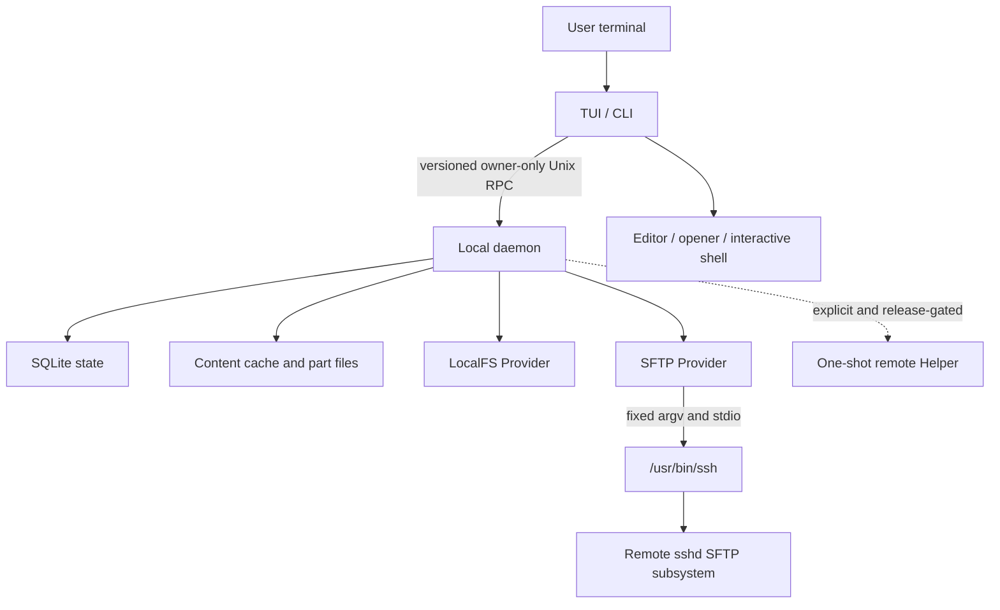

# AMSFTP 架构总览

本文描述当前 `main` 中已经存在的架构、信任边界和数据安全不变量。未来方向见[路线图](../product/roadmap.md)；不可逆决策见本目录的 [ADR](adr/)。

## 1. 系统目标与当前边界

AMSFTP 是一个单用户、本机运行的终端文件工作台。TUI/CLI 可以同时操作两个本地或远端位置；本地 daemon 持有连接、Job、缓存和持久状态；远端认证与主机策略由系统 OpenSSH 负责。

当前内部预览支持标准 Level 0 SFTP。Helper 的协议、测试 fixture 和部分生命周期代码已经存在，但 production 分发保持 CLOSED；Level 2 控制面和测试数据面存在，但 production 跨主机直传保持 CLOSED。

## 2. 架构原则

1. **OpenSSH 是认证事实源**：应用不复制或重新实现用户的 SSH、Kerberos、Agent 和 host-key 策略。
2. **客户端可退出，任务不丢失**：TUI/CLI 负责交互，daemon 负责持久运行和恢复。
3. **写操作先计划后执行**：用户动作先转换成不可变 Plan，再由 transfer 层执行。
4. **能力驱动**：路由只使用当前 session 已证明的 Provider 能力；能力变化后重新规划或明确失败。
5. **安全提交**：内容先写 Job 专属 part，验证与提交完成后才暴露最终目标。
6. **move 不提前删源**：目标未验证并提交前绝不删除来源。
7. **资源有界**：列表、搜索、预览、事件、缓存和传输不随完整数据规模无限增长。
8. **显式降级**：增强能力不可用时回到 Level 0，并给出稳定原因，不通过隐式提权换取性能。

## 3. 进程与信任边界

### TUI 与 CLI

`internal/tui` 保存纯 model/reducer 和渲染状态。它负责键盘输入、可见窗口、选择、抽屉、提示和确认，不直接调用 LocalFS 或 SFTP mutation。`internal/app` 把 CLI/TUI 意图映射为 RPC、查询或结构化操作。

客户端退出只释放自己的会话和终端状态，不等于取消后台 Job。取消、暂停和恢复必须通过明确的 Job RPC。

### 本地 daemon

`internal/daemon` 是运行时事实源：

- 建立和释放 Provider session。
- 维护每个 Endpoint 的能力快照和 generation。
- 创建、执行、恢复和查询持久 Job。
- 协调搜索、预览、编辑、缓存、诊断和 Helper 路由。
- 通过 owner-private Unix socket 提供版本化 IPC。

daemon 只以当前 OS 用户运行，不监听 TCP，也不要求 root。

### 系统 OpenSSH

SFTP Provider 使用经过验证的绝对 `/usr/bin/ssh`，通过固定安全参数启动 SFTP subsystem，并在 stdin/stdout 上承载结构化 SFTP 协议。调用不经过 shell，host alias 不能被解释为命令行选项。

具体 argv、路径所有权、ControlMaster、转发和 GSS delegation 边界由 [ADR-0001](adr/0001-system-openssh-transport.md) 定义。OpenSSH 仍负责 `~/.ssh/config`、Include/Match、host key、密钥、Agent、Kerberos、ProxyJump、ProxyCommand 和交互认证。

### 可选 Helper

Helper 是一次性受限远端进程，不监听端口、不常驻、不提权。只有经过签名信任、版本兼容、用户同意、远端环境探测和原子安装的 production artifact 才能开放；这些真实发行门禁目前未完成，因此公开生命周期保持 CLOSED。

## 4. 代码模块

| 模块 | 责任 |
| --- | --- |
| `cmd/amsftp` | 单一可执行文件入口和构建身份 |
| `internal/app` | CLI/TUI 命令编排、退出码和人类/JSON 输出 |
| `internal/selfupdate` | Homebrew/独立安装渠道识别、发布版本解析、installer checksum 与固定命令执行 |
| `internal/tui` | Vim-first model、reducer、tcell 输入与窗口化渲染 |
| `internal/daemon` | session、RPC handler、后台生命周期和服务组合 |
| `internal/ipc` | framed JSON、握手、版本、请求 ID 与安全错误 |
| `internal/domain` | Endpoint、Location、能力、错误和 Job 领域类型 |
| `internal/provider` | Provider 接口、LocalFS、SFTP、fake 与 contract suite |
| `internal/transfer` | Plan、路由、worker、提交、恢复、调度和资源账本 |
| `internal/state`、`internal/statefs` | SQLite schema、迁移、备份、恢复和安全文件系统边界 |
| `internal/cache`、`internal/cachefs` | 内容缓存、租约、配额和 no-follow 文件操作 |
| `internal/search` | 有界文件名与内容搜索 |
| `internal/helper` | Helper manifest、协议、安装策略和受限生命周期 |
| `internal/platform`、`internal/transport/openssh` | 平台路径、安装前信任预检、managed-root 布局、权限和 OpenSSH 子进程安全边界 |

## 5. 领域模型

### Endpoint 与 Location

Endpoint 表示一个 Provider 身份，包含稳定 ID、类型和显示信息，不包含密码或密钥。Location 是 Endpoint ID 与规范化绝对路径的组合；相同路径位于不同 Endpoint 时不是同一对象。

### Session 与能力快照

每次 Provider 连接产生独立 session 和单调 generation。能力快照只对该 session 有效；重连、Helper 消失或 server 能力变化后不得盲目复用旧值。

### OperationIntent、Plan 与 Job

- OperationIntent 表示用户希望执行的操作。
- Planner 冻结来源、目标、冲突策略、完整性、路由和确认要求。
- Job 持久化 Plan、状态、阶段检查点、事件和控制动作。
- Worker 只执行冻结 Plan；需要改变路由或策略时必须产生明确的新证据或重新规划。

## 6. Job 生命周期

典型状态包括 queued、running、paused、waiting_auth、waiting_conflict、completed、failed 和 canceled。恢复不是简单地重新执行整个操作：

1. 读取持久 Plan 与检查点。
2. 检查来源指纹、part 和最终目标的当前后置状态。
3. 只重放可证明幂等的阶段。
4. 对提交、rename 和源删除等非幂等边界先验证结果，再继续或停在可操作状态。

用户关闭 TUI、网络中断或 daemon 重启都不能把未知结果直接标记为成功。

## 7. Provider 与路由

Provider 提供分页列表、stat、range read 和可选 mutation；Planner 只依据能力选择路径：

1. 同 Endpoint 优先安全 rename、server-copy 或已允许的 Helper same-host 路径。
2. LocalFS 与 SFTP 之间使用流式传输。
3. 两个远端默认通过本机 daemon 做有界内存中继。
4. Level 2 只有在 production 数据面和全部信任门禁开放后才能选择。

路由失败在目标提交前可以按明确原因降级；越过提交边界后不能盲目换路重试。

## 8. 关键数据流

### 浏览

TUI 发出带 pane generation 的列表请求；daemon 从 Provider 分页读取并回传。reducer 只接受当前 generation，renderer 只构造可见行和有界 overscan。取消、断线或权限错误产生明确 partial 状态。

### 复制与移动

Planner 读取来源指纹和目标能力，冻结冲突与完整性策略。Worker 写入目标 part、同步和验证，再提交最终名称。move 只有在目标提交并满足验证等级后才执行来源删除；否则以“目标完成但来源保留”收尾。

### 编辑与外部打开

daemon materialize 内容缓存并创建租约，记录远端版本。TUI 暂停后启动编辑器或 opener，返回时比较本地内容和最新远端指纹。双向变化进入冲突选择，不静默覆盖。

### 搜索

文件名和内容搜索都有时间、结果、并发、深度和字节预算。Helper 可用时可以提供增强路径；否则使用受限 SFTP 遍历并明确 partial 或预算耗尽。

## 9. 持久化与缓存

SQLite 保存 workspace 索引、Job、事件、检查点和受控元数据。schema 只前向迁移；迁移前执行空间、备份和身份检查，失败保持可诊断或只读状态，不能通过删除数据库“修复”。

内容缓存按强指纹或受限弱指纹建立条目，使用 LRU、ephemeral 或 pinned offline 策略。活跃预览、编辑和 opener 持有租约，清理不能回收被租用内容。传输 part 与预览缓存分离，均受 owner、mode、no-symlink 和配额检查。

## 10. IPC 与错误

IPC 使用带长度边界的版本化 framed JSON。握手在业务请求前验证协议兼容和 peer UID。每个请求有 request ID；业务错误使用稳定 code、retry 和 effect 字段。

TUI、CLI JSON、日志和支持包不得直接输出 raw cause、完整路径、命令参数、Endpoint 名、凭据或认证答案。需要定位底层问题时由 owner-private 本地日志保存经过 allowlist 的结构化字段。

## 11. 安全与正确性不变量

- 不持久化认证秘密或票据。
- 不绕过 OpenSSH host-key 与代理策略。
- 不默认转发 Agent、委托 Kerberos 或复制密钥。
- 不在验证和提交前暴露最终目标或删除 move 来源。
- 不静默覆盖并发修改。
- 不跟随不受信任路径中的 symlink，也不接受宽松 owner/mode。
- 不让 Helper 或 Level 2 配置绕过 production CLOSED 门禁。
- 不让目录、日志、事件、搜索或缓存无限增长。
- 不把 fixture、交叉编译或文档声明冒充真实发布证据。

## 12. 可观测性与恢复

daemon 写 owner-only、有大小与保留上限的结构化日志。Jobs 抽屉和 CLI 暴露稳定状态、阶段、计数器、等待原因与控制动作。`doctor` 只读检查配置、运行目录、socket、daemon、OpenSSH、known-host policy、数据库、缓存、Helper 和磁盘空间。

支持包先生成精确 preview 和 consent digest，再允许输出本地私有归档；创建时数据变化会使同意失效，产品不提供上传命令。

## 13. 明确不做

- 自研 SSH、Kerberos 或凭据保险箱。
- Windows 原生体验、GUI、Finder 扩展或 FUSE 挂载。
- 未经用户批准的远端安装、提权或常驻服务。
- 内嵌完整终端模拟器或完整 Vim 宏/寄存器生态。
- 以跳过冲突、验证、恢复或 trust gate 换取表面性能。
