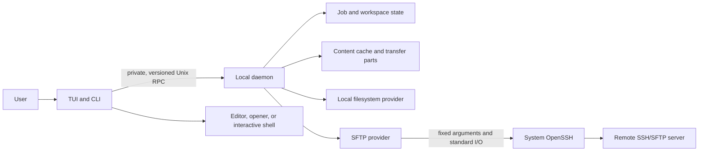

# Architecture

[简体中文](../zh-CN/architecture/overview.md)

AMSFTP is a two-pane terminal workspace for local and SFTP files. Either pane
can point to the local machine or to an SSH host, so the same interaction model
works for local-to-local, local-to-remote, and remote-to-remote work.

This page explains the shape of the system and why it is built this way. For
the security boundary and the assumptions behind it, see
[Security](security.md).

## The problems the design addresses

A file browser can be a single interactive process, but a dependable transfer
tool has harder requirements:

- an SSH connection may need an agent, Kerberos, a jump host, or an interactive
  host-key decision;
- a large transfer must survive the TUI closing or a network interruption;
- remote names and metadata cannot be trusted merely because authentication
  succeeded;
- a copy or move must not expose a half-written final file;
- directory listings, previews, searches, logs, and queues must remain usable
  when the remote tree is large.

AMSFTP separates interaction from durable work and keeps each of those
boundaries explicit.

## System at a glance

AMSFTP is distributed as one executable, but it can take on several tightly
defined roles. The normal TUI and CLI are short-lived clients. The local daemon
owns connections and long-running work. Restricted internal roles support
authentication and optional remote integration without becoming separate
services.

The daemon runs as the current operating-system user. It does not listen on a
TCP port, run as root, or provide a multi-user service.

## Client and daemon

The client owns everything tied to the terminal: input, rendering, selection,
confirmation dialogs, and handing the terminal to an editor or interactive
shell. It turns a user action into a structured request; it does not write to a
remote provider directly.

The daemon owns:

- local and remote provider sessions;
- the capabilities observed for each live session;
- persistent Jobs and their control actions;
- transfer planning, execution, and recovery;
- workspace state, preview materialization, and cache leases;
- bounded diagnostics.

This split means that closing the TUI does not implicitly cancel a transfer.
Pause, resume, and cancellation are explicit Job operations. It also gives
recovery one owner: after a restart, the daemon can compare recorded progress
with the current source and destination before doing more work.

Client and daemon communicate over an owner-private Unix socket. The handshake
checks the protocol version and peer user before a request reaches business
logic. Messages have size and time limits, and every request has an identity
that can be correlated with a safe error report.

## Endpoints, locations, and providers

An **Endpoint** identifies one filesystem boundary: the local machine or a
particular SSH host. A **Location** combines an Endpoint with an absolute path.
The same path on two Endpoints therefore refers to two different objects.

A provider presents a common set of operations such as listing a directory,
reading ranges, inspecting metadata, and applying supported changes. The main
providers are:

- **Local filesystem**, for files owned by the local operating-system account;
- **SFTP**, for files reached through a system OpenSSH session.

Each connection produces a fresh capability view. Planning uses only
capabilities proven for that live session. If a server reconnects with a
different capability set, AMSFTP refreshes the view instead of assuming an old
fast path is still safe.

Standard SFTP is the compatibility baseline. Remote-to-remote copies normally
flow through a bounded in-memory relay in the local daemon. The source is read
and the destination is written in chunks; the whole file is not staged in
memory or silently stored as a local copy.

The codebase contains boundaries for an optional one-shot remote Helper and a
direct remote transfer path. Current public builds do not enable either path,
so neither is required for normal browsing or transfer. Routing stays on
standard SFTP or the local relay when an enhancement is unavailable.

## OpenSSH remains the SSH authority

The SFTP provider starts the validated system `/usr/bin/ssh` with structured,
fixed arguments and communicates with the SFTP subsystem over standard input
and output. It does not scrape the text output of the interactive `sftp`
program, and it does not pass the host alias through a shell.

OpenSSH continues to interpret:

- `~/.ssh/config`, including `Include` and `Match`;
- host keys and known-hosts policy;
- keys, SSH Agent, security keys, and interactive authentication;
- Kerberos/GSSAPI;
- `ProxyJump` and `ProxyCommand`.

AMSFTP intentionally has no second SSH implementation or credential database.
This preserves the connection behavior users already test with
`/usr/bin/ssh <alias>`.

## From an action to a durable Job

Changes follow the same path whether they begin in the TUI or CLI:

1. The client describes the requested operation and any explicit conflict
   choice.
2. The daemon inspects the source and destination and freezes a plan: objects,
   route, integrity policy, confirmation requirements, and expected state.
3. The plan becomes a persistent **Job** with events and checkpoints.
4. A worker executes only that frozen plan. A material change requires a new
   decision or a safe replan; it is not hidden inside a retry.

Jobs can be queued, running, paused, waiting for authentication or a conflict,
completed, failed, or canceled. The exact state is durable, so a disconnected
client does not turn an unknown result into success or failure.

### Copy and move

A streamed copy writes to a Job-specific temporary destination. Progress is
recorded only after the corresponding data has crossed the durability boundary.
AMSFTP then verifies the temporary result and publishes the final name.
Incomplete content is never presented as the intended final file.

A move is copy-and-commit followed by a separately checked source removal.
The source is not deleted until the destination has been verified and
committed. If destination publication succeeds but source removal cannot be
proved, the safe result is to keep the source and report the remaining work.

Retries follow the same principle. AMSFTP repeats only steps that are known to
be idempotent, or first checks whether a step such as rename, commit, or delete
already took effect.

### Browse and search

Directory entries arrive incrementally. Every pane request carries a generation
so a delayed response from an old directory cannot overwrite the current view.
The TUI renders the visible window rather than constructing a row for every
entry.

File-name and content searches have limits on depth, time, bytes, results, and
concurrency. Reaching a limit produces a visible partial result. It does not
turn a truncated search into a misleading complete answer.

### Preview, edit, and open

Preview reads only the range it needs and adapts to terminal capabilities.
Remote editing and external opening materialize content into the private cache
and hold a lease while another program uses it.

For editing, AMSFTP records the starting remote identity. When the editor
returns, it compares the edited local copy with the current remote object. If
both sides changed, the upload becomes a conflict rather than a silent
overwrite.

Editors, openers, and interactive shells are launched by the client because it
owns the terminal. The daemon continues managing Jobs while the TUI is
temporarily suspended.

## State, cache, and recovery

SQLite stores durable system state: Jobs, events, checkpoints, workspace
indexes, and other bounded metadata. Saved workspace documents contain pane
locations and view preferences; they never contain authentication material.

The content cache is separate from transfer parts and persistent Job state.
Entries have quotas and eviction policy, while active previews, edits, and
openers hold leases that prevent their content from being reclaimed.

State-format changes move forward through checked migrations. A migration
validates the existing store and preserves the recovery material it needs
before publishing a new state. If a result is uncertain, startup becomes
read-only or stops with a stable diagnosis. Deleting the database is not an
automatic repair strategy, and an older executable is not allowed to write a
newer format blindly.

During a self-upgrade, a private upgrade lock prevents a second upgrade or an
old client from racing to restart the old daemon. Active Jobs block package
replacement. After the package changes, the new binary and daemon version are
checked before the operation reports success.

## Bounded work and graceful degradation

Every stream that can grow is controlled: directory pages, preview bytes,
search traversal, transfer buffers, event history, logs, queues, cache usage,
connections, and concurrent workers.

These limits are part of the product behavior. Under pressure, AMSFTP applies
backpressure, queues work, returns a partial result, or reports a stable
resource error. It does not trade away integrity or silently enable a more
privileged route to remain fast.

## Errors and diagnostics

User-visible and JSON errors contain stable fields such as a code, request ID,
retry guidance, and whether an effect may have occurred. Raw provider errors,
paths, commands, environment values, and authentication material do not pass
directly into Jobs, logs, or the TUI.

`doctor` performs bounded, read-only checks. Support bundles are built from an
allowlist of diagnostic fields, require a preview and matching consent digest,
and are written only to a new private local file. AMSFTP has no automatic
support-bundle upload.

## Source layout

The implementation follows the same boundaries:

| Area | Responsibility |
| --- | --- |
| `cmd/amsftp` | executable entry point and build identity |
| `internal/app`, `internal/tui` | CLI/TUI orchestration, interaction, and rendering |
| `internal/daemon`, `internal/ipc` | background lifecycle and private local RPC |
| `internal/domain` | stable Endpoint, Location, capability, error, and Job types |
| `internal/provider` | local filesystem and SFTP provider contracts |
| `internal/transfer` | planning, routing, workers, commit, resume, and scheduling |
| `internal/state`, `internal/statefs` | SQLite state, migrations, and safe filesystem access |
| `internal/cache`, `internal/cachefs` | content cache, leases, quotas, and safe file access |
| `internal/search`, `internal/helper` | bounded search and optional enhancement boundary |
| `internal/platform`, `internal/transport/openssh` | platform-private paths and system OpenSSH process boundary |

## Invariants worth remembering

- OpenSSH remains the source of truth for SSH configuration, authentication,
  and host-key policy.
- The TUI and CLI do not bypass the daemon to mutate a provider.
- A final destination is not exposed until its temporary content is verified
  and committed.
- A move source is not deleted before the destination is safe.
- Recovery crosses only checked or idempotent boundaries.
- Authentication secrets do not enter persistent application state.
- Private directories, files, and sockets must pass owner, mode, symlink, and
  peer checks.
- Lists, searches, previews, logs, caches, events, and transfer resources stay
  bounded.
- Optional enhancements must fail back to the standard path without weakening
  SSH or credential policy.

These rules matter more than any individual optimization. New features fit the
architecture only when they preserve them.
