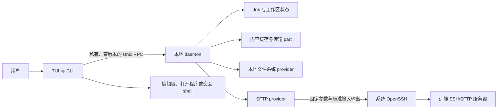

# 架构

[English](../../architecture/overview.md)

AMSFTP 是一个同时操作本地和 SFTP 文件的双栏终端工作台。任意一栏都可以指向
本机或一台 SSH 主机，因此本地到本地、本地到远端、远端到远端都使用同一种交互
方式。

本文介绍系统的整体形态，以及为什么采用这样的设计。安全边界和必要假设见
[安全设计](security.md)。

## 这套设计要解决什么问题

普通文件浏览器可以只有一个交互进程，但可靠的传输工具还要面对更多问题：

- SSH 连接可能依赖 Agent、Kerberos、跳板机或交互式主机密钥确认；
- 传输大文件时，即使 TUI 关闭或网络中断，任务也不能丢失；
- 认证成功不代表远端返回的名称和元数据可以直接信任；
- 复制或移动不能把只写了一部分的文件暴露为最终文件；
- 面对大型远端目录树时，列表、预览、搜索、日志和队列仍需保持可用。

AMSFTP 把交互和持久工作分开，并让这些边界都保持明确。

## 系统一览

AMSFTP 只发布一个可执行文件，但它可以承担几个边界明确的角色。日常使用的 TUI
和 CLI 是短生命周期客户端；本地 daemon 持有连接和长期任务；受限的内部角色负责
认证和可选远端集成，但不会成为独立服务。

daemon 以当前操作系统用户运行，不监听 TCP 端口，不需要 root，也不提供多用户
服务。

## 客户端与 daemon

客户端负责所有与终端直接相关的工作：输入、渲染、选择、确认弹窗，以及把终端临时
交给编辑器或交互 shell。它把用户动作转换成结构化请求，不直接向远端 provider
写入内容。

daemon 负责：

- 本地和远端 provider session；
- 每个活动 session 已实际观察到的能力；
- 持久 Job 及其控制操作；
- 传输计划、执行与恢复；
- 工作区状态、预览内容准备和缓存租约；
- 有界诊断信息。

这样的拆分意味着关闭 TUI 不会顺带取消传输。暂停、继续和取消都是明确的 Job
操作。恢复也只有一个责任主体：daemon 重启后可以比较记录的进度和当前两端状态，
再决定能否继续。

客户端与 daemon 通过仅供当前用户访问的 Unix socket 通信。握手会先校验协议
版本和对端用户，再让请求进入业务逻辑。消息有大小和时间限制，每个请求都有可用于
安全错误关联的身份。

## Endpoint、Location 与 provider

**Endpoint** 表示一个文件系统边界：本机，或某个确定的 SSH 主机。
**Location** 由 Endpoint 和绝对路径组成。因此，即使路径文本相同，只要 Endpoint
不同，就表示两个不同对象。

provider 提供统一的操作集合，例如列出目录、分段读取、查看元数据，以及执行当前
环境支持的修改。主要 provider 有：

- **本地文件系统**：操作当前操作系统账号可访问的本地文件；
- **SFTP**：通过系统 OpenSSH session 访问远端文件。

每次连接都会产生一份新的能力视图。制定计划时，只使用当前 session 已证明的能力。
服务器重连后的能力如果变化，AMSFTP 会刷新视图，不会假定原来的快速路径仍然安全。

标准 SFTP 是兼容性基线。远端到远端的复制通常经过本地 daemon 中有大小限制的内存
中继：来源按块读取，目标按块写入，不会把整个文件放进内存，也不会暗中把它完整
保存到本地。

代码中保留了可选一次性远端 Helper 和远端直传的边界，但当前公开构建没有开启这
两条路径。日常浏览和传输不依赖它们；增强路径不可用时，路由会继续使用标准 SFTP
或本地中继。

## SSH 事务仍由 OpenSSH 决定

SFTP provider 使用结构化的固定参数启动经过验证的系统 `/usr/bin/ssh`，并通过
标准输入输出与 SFTP subsystem 通信。它不会解析交互式 `sftp` 程序的文本输出，
也不会把主机别名交给 shell 解释。

以下内容继续由 OpenSSH 处理：

- `~/.ssh/config`，包括 `Include` 和 `Match`；
- 主机密钥和 known-hosts 策略；
- 密钥、SSH Agent、安全密钥和交互式认证；
- Kerberos/GSSAPI；
- `ProxyJump` 与 `ProxyCommand`。

AMSFTP 有意不实现第二套 SSH 协议栈或凭据数据库。用户可以继续以
`/usr/bin/ssh <alias>` 作为连接行为的事实依据。

## 从用户动作到持久 Job

无论操作从 TUI 还是 CLI 发起，修改都会沿着同一条路径执行：

1. 客户端描述所需操作，以及用户明确作出的冲突选择。
2. daemon 检查来源和目标，冻结一份计划，包括对象、路由、完整性策略、确认要求
   和预期状态。
3. 计划变成持久 **Job**，并拥有自己的事件和检查点。
4. worker 只执行这份冻结计划。如果实际情况发生实质变化，必须重新做决定或安全
   地重新规划，不能把策略变化藏在一次重试里。

Job 可能处于排队、运行、暂停、等待认证、等待冲突处理、完成、失败或取消状态。
准确状态会持久保存，因此客户端断线不会把未知结果误判成成功或失败。

### 复制与移动

流式复制先写入 Job 专属的临时目标。只有对应数据跨过持久化边界后，进度才会记录。
随后 AMSFTP 验证临时结果并发布最终名称。未完成的内容不会以预期最终文件的身份
出现。

移动是在“复制并提交”之后，再单独检查并删除来源。目标验证和提交之前，来源绝不
删除。如果目标发布成功、但无法证明来源删除也成功，安全结果是保留来源，并报告
尚未完成的部分。

重试遵循同一个原则：只重复已知幂等的步骤；遇到重命名、提交或删除等步骤时，先
检查前一次操作是否已经生效。

### 浏览与搜索

目录项按增量返回。每个栏的请求都带有 generation，因此旧目录延迟到达的响应不会
覆盖当前视图。TUI 只渲染可见窗口，不会为目录里的每一项都构建显示行。

文件名和内容搜索限制了深度、时间、字节数、结果数和并发量。达到限制时会明确显示
部分结果，不会把被截断的搜索误报为完整结果。

### 预览、编辑与打开

预览只读取实际需要的范围，并根据终端能力调整显示方式。远端编辑和外部打开会把
内容准备到私有缓存中，在其他程序使用期间保持租约。

编辑开始时，AMSFTP 会记录远端对象的初始身份。编辑器退出后，它会把本地编辑结果
与远端当前对象比较。如果两边都发生变化，上传会进入冲突处理，而不是静默覆盖。

编辑器、打开程序和交互 shell 由客户端启动，因为终端归客户端管理。TUI 暂停期间，
daemon 仍会继续管理 Job。

## 状态、缓存与恢复

SQLite 保存系统的持久状态，包括 Job、事件、检查点、工作区索引和其他有界元数据。
工作区文档只保存两栏位置和视图偏好，不保存认证材料。

内容缓存与传输 part、持久 Job 状态相互独立。缓存条目受配额和回收策略管理；预览、
编辑器或打开程序正在使用的条目持有租约，不会被回收。

状态格式通过经过检查的迁移向前演进。迁移会先验证现有状态并保留恢复所需材料，
再发布新状态。如果结果不确定，启动会进入只读或以稳定诊断停止。删除数据库不是
自动修复策略，旧二进制也不能盲目写入较新的状态格式。

自升级期间，私有升级锁会阻止第二个升级，也防止旧客户端抢先重启旧 daemon。有
活动 Job 时不会替换软件包。软件包更新后，只有新二进制和 daemon 版本都通过检查，
升级才会报告成功。

## 有界工作与安全降级

所有可能持续增长的数据流都有上限：目录分页、预览字节、搜索遍历、传输缓冲、
事件历史、日志、队列、缓存用量、连接数和并发 worker。

这些限制本身就是产品行为。资源紧张时，AMSFTP 会施加背压、排队、返回部分结果，
或报告稳定的资源错误；不会为了保持速度而牺牲完整性，或暗中开启权限更高的路由。

## 错误与诊断

面向用户和 JSON 的错误只包含稳定字段，例如错误码、request ID、重试建议和操作
是否可能已经生效。底层 provider 的原始错误、路径、命令、环境变量和认证材料不会
直接进入 Job、日志或 TUI。

`doctor` 执行有界的只读检查。支持包只从允许的诊断字段构建，必须先预览并取得匹配
的 consent digest，然后才能写入一个新的本地私有文件。AMSFTP 不会自动上传支持包。

## 源码结构

实现代码遵循相同的边界：

| 目录 | 职责 |
| --- | --- |
| `cmd/amsftp` | 可执行文件入口和构建身份 |
| `internal/app`、`internal/tui` | CLI/TUI 编排、交互与渲染 |
| `internal/daemon`、`internal/ipc` | 后台生命周期和私有本地 RPC |
| `internal/domain` | 稳定的 Endpoint、Location、能力、错误和 Job 类型 |
| `internal/provider` | 本地文件系统与 SFTP provider 契约 |
| `internal/transfer` | 计划、路由、worker、提交、恢复和调度 |
| `internal/state`、`internal/statefs` | SQLite 状态、迁移和安全文件系统访问 |
| `internal/cache`、`internal/cachefs` | 内容缓存、租约、配额和安全文件访问 |
| `internal/search`、`internal/helper` | 有界搜索和可选增强边界 |
| `internal/platform`、`internal/transport/openssh` | 平台私有路径与系统 OpenSSH 进程边界 |

## 必须始终成立的规则

- SSH 配置、认证和主机密钥策略以 OpenSSH 为准。
- TUI 和 CLI 不能绕过 daemon 直接修改 provider。
- 临时内容经过验证和提交之前，不能暴露为最终目标。
- 目标安全之前，移动操作不能删除来源。
- 恢复只能跨越已检查或已知幂等的边界。
- 认证秘密不能进入应用的持久状态。
- 私有目录、文件和 socket 必须通过所有者、mode、符号链接和对端检查。
- 列表、搜索、预览、日志、缓存、事件和传输资源必须有界。
- 可选增强失败时必须回到标准路径，不能削弱 SSH 或凭据策略。

这些规则比任何单项性能优化都更重要。新功能只有在继续满足它们时，才适合进入这套
架构。
